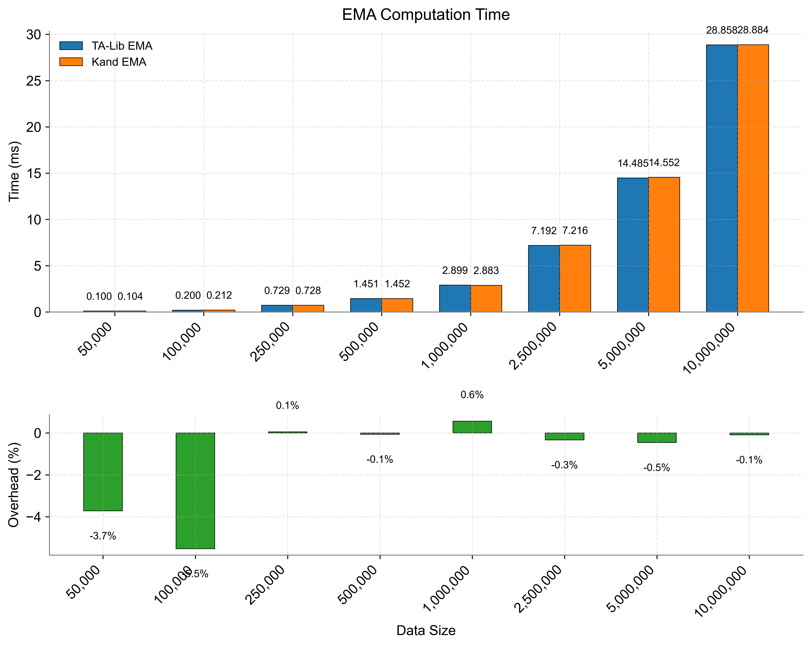
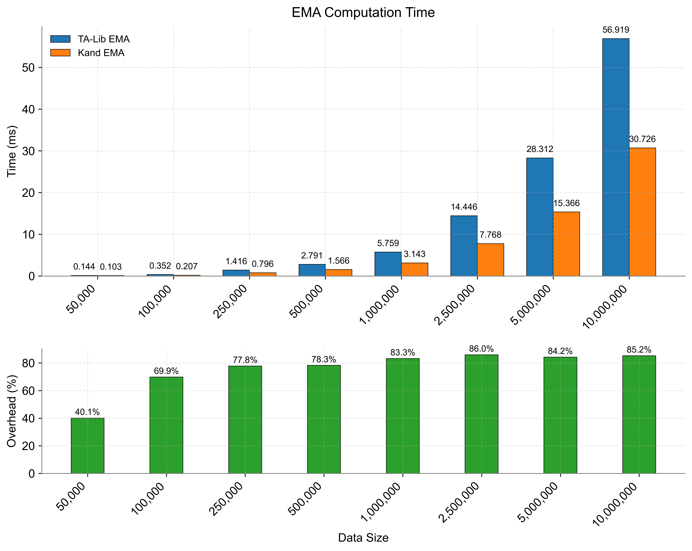
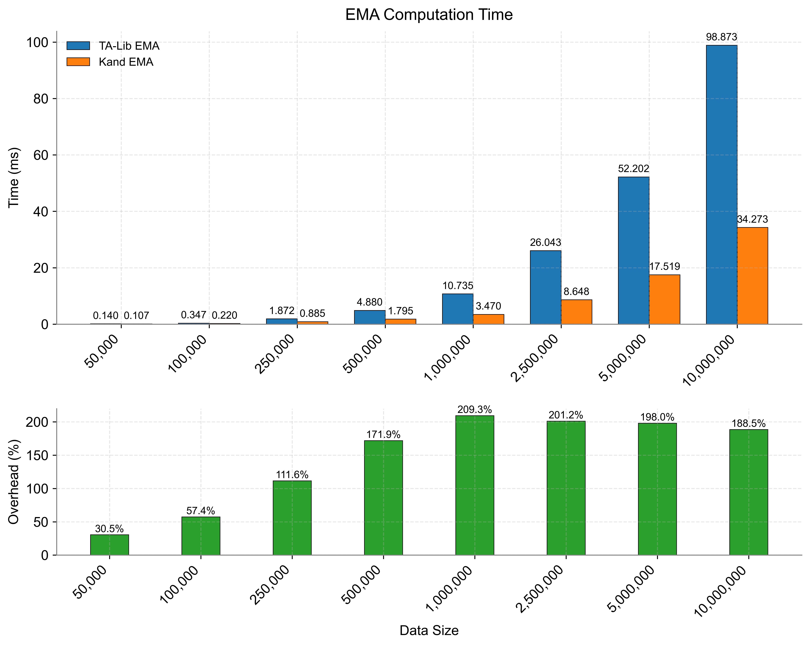
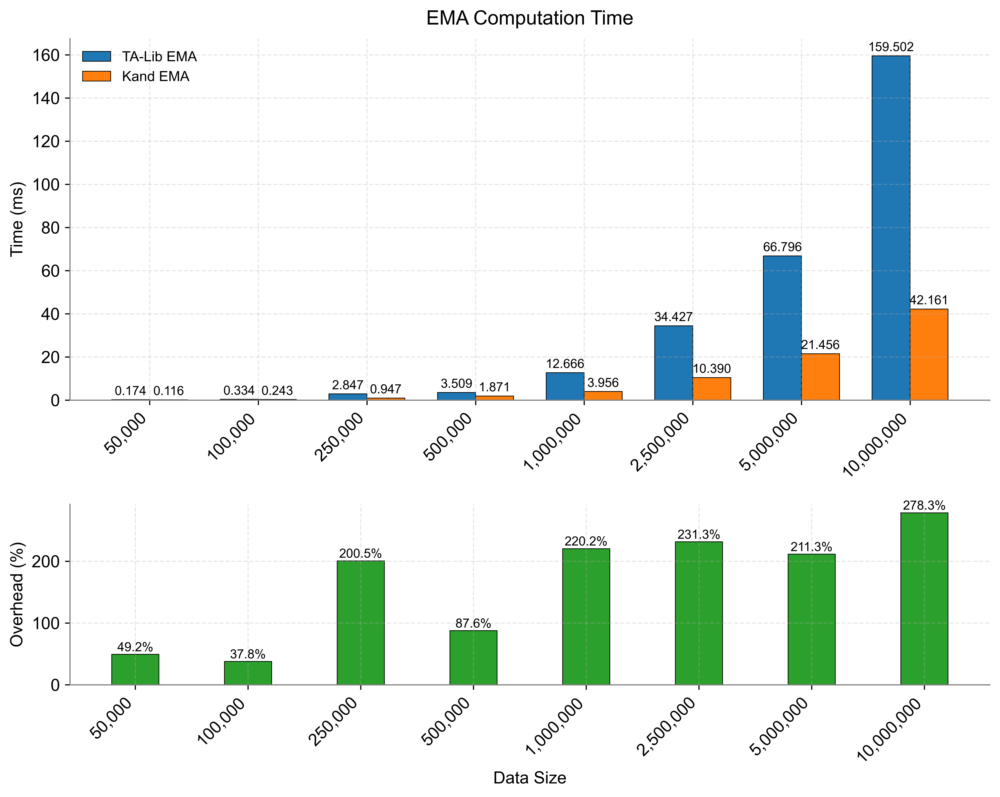
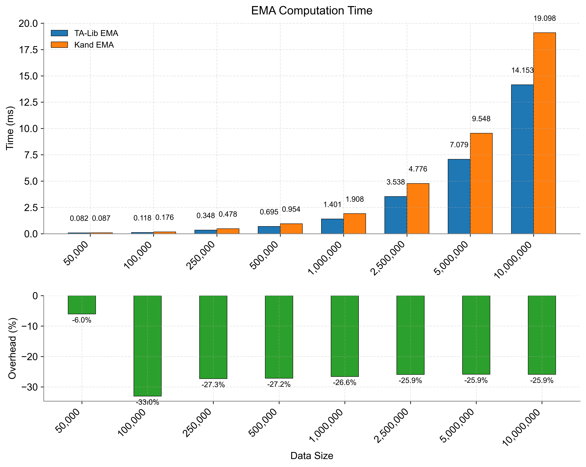
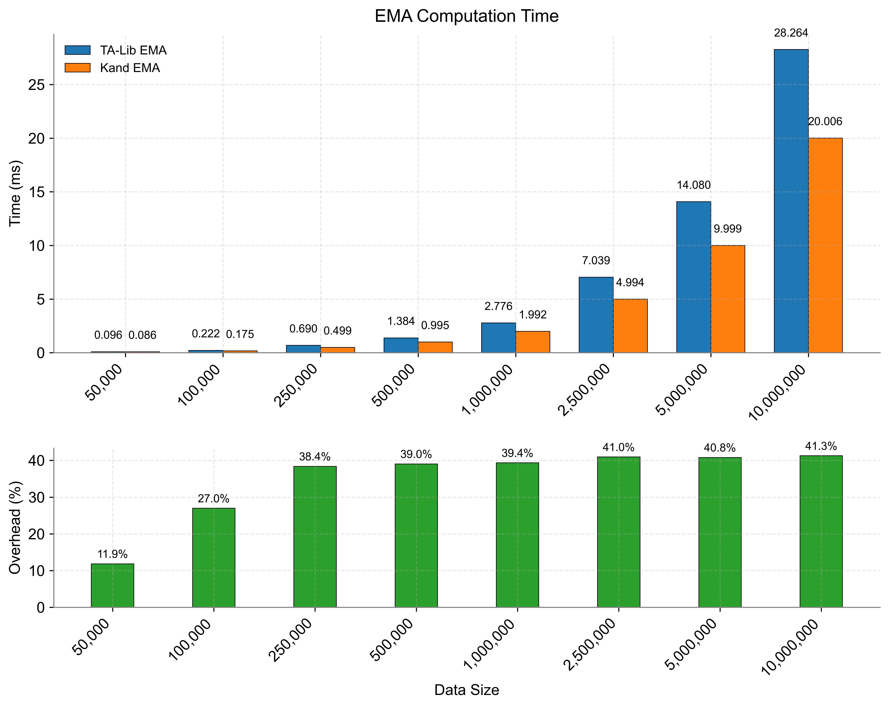
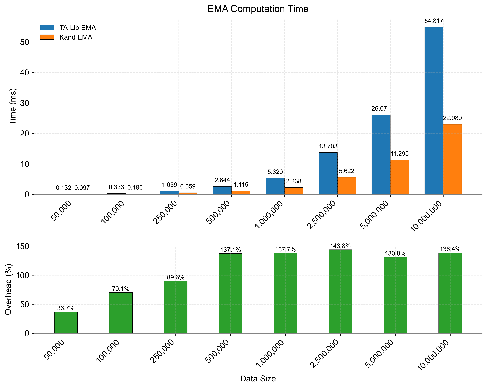

# Performance Testing

## Introduction

This document showcases the performance testing results for Exponential Moving Average (EMA) computations, comparing single-threaded and multi-threaded approaches. Tests were conducted on two platforms: a Windows laptop featuring an Intel Core i7-13700 processor and a Mac Mini powered by an Apple M4 chip. The analysis highlights how thread count impacts computational efficiency across diverse dataset sizes, with a special focus on the superior scalability of `kand` over `talib`.

!!! info
    **`kand` vs. `talib`**: While `talib` is constrained to single-threaded execution, `kand` leverages multi-threading to unlock significant performance gains, especially on modern multi-core hardware.

---

## Test Environment

!!! abstract "Hardware Specifications"
    === "Windows Platform"
        - **Device**: Laptop
        - **CPU**: Intel Core i7-13700
            * 6 Performance cores
        - **OS**: Windows 11 Pro

    === "Mac Platform"
        - **Device**: Mac Mini
        - **CPU**: Apple M4
            * 4 Performance cores
        - **OS**: macOS Sonoma

!!! info "Software Stack"
    | Component     | Version | Description |
    |--------------|---------|-------------|
    | :snake: Python | 3.11    | Core runtime environment |
    | :chart_with_upwards_trend: TA-Lib | 0.6.3   | Technical analysis baseline |
    | :zap: Kand    | 0.0.11  | High-performance implementation |

!!! tip "Version Compatibility"
    All tests were conducted using the latest stable releases of each component. Performance characteristics may vary with different versions.

---

## Test Methodology

!!! note "Test Code Location"
    All benchmark code is available in the `python/benches` directory:
    - `bench_ema.py`: Single-thread performance testing
    - `bench_ema_mt.py`: Multi-thread performance testing

!!! warning "System Variability"
    Performance results may vary significantly across different systems due to:
    - CPU architecture and clock speeds
    - Memory configuration and speed
    - Operating system scheduling
    - System load and background processes
    - Thermal conditions

    We strongly recommend running the benchmarks on your specific system for the most accurate performance assessment.

- **Single-threaded tests**: Executed using 1 thread with `talib.EMA`.
- **Multi-threaded tests**: Conducted with `kand.ema`:
  - Windows i7-13700: 2, 4, and 6 threads.
  - Mac Mini M4: 2 and 4 threads.
- **Dataset sizes**: 50K, 100K, 250K, 500K, 1M, 2.5M, 5M, 10M data points.
- **EMA period**: 30.
- **Runs per test**: 1000 iterations to calculate average execution time.
- **Tools**: Python scripts leveraging `talib.EMA` (single-threaded) and `kand.ema` (multi-threaded).

---

## Results

### Windows i7-13700 Mobile

=== "Single-threaded"
    
    *Figure 1: EMA computation performance on Windows with 1 thread using `talib`.*

=== "2 Threads"
    
    *Figure 2: Performance with 2 threads using `kand`.*

=== "4 Threads"
    
    *Figure 3: Performance with 4 threads using `kand`.*

=== "6 Threads"
    
    *Figure 4: Performance with 6 threads using `kand`.*

### Mac Mini M4

=== "Single-threaded"
    
    *Figure 5: EMA computation performance on Mac Mini with 1 thread using `talib`.*

=== "2 Threads"
    
    *Figure 6: Performance with 2 threads using `kand`.*

=== "4 Threads"
    
    *Figure 7: Performance with 4 threads using `kand`.*

---

## Analysis

The results reveal compelling insights into performance trends:

- **Multi-threading Advantage with `kand`**: Unlike `talib`, which is bottlenecked by single-threaded execution, `kand` harnesses multiple threads to drastically reduce EMA computation times. This advantage becomes increasingly evident with larger datasets (e.g., 5M and 10M points).

- **Scalability**:

  - On the Windows i7-13700, performance peaks at 6 threads, fully utilizing its 6 P-cores.
  - On the Mac Mini M4, efficiency maxes out at 4 threads, aligned with its 4 P-cores.

!!! tip "Why `kand` Outshines `talib`"
    The single-threaded nature of `talib` limits its ability to exploit modern multi-core CPUs. In contrast, `kand`’s multi-threaded design scales seamlessly with core count, delivering superior performance on datasets of any size.

!!! success "Key Takeaway"
    By embracing multi-threading, `kand` unlocks the full potential of modern processors, leaving `talib`’s single-threaded approach in the dust—especially for high-performance financial computations.

!!! note "Key Takeaway"
    📌 Thread counts are capped by the number of performance cores (P-cores). The i7-13700 supports up to 6 threads with its 6 P-cores, while the M4 is limited to 4 threads due to its 4 P-cores.

---

## Conclusion

Multi-threading capabilities in `kand` deliver exceptional performance gains across various technical analysis computations, consistently outperforming the single-threaded limitations of traditional libraries like `talib`. Our benchmarks on the Windows i7-13700 (6 P-cores) and Mac Mini M4 (4 P-cores) demonstrate impressive scalability, with the i7-13700 achieving superior throughput at higher thread counts. For applications dealing with large-scale financial data processing, `kand`'s sophisticated multi-core utilization architecture provides a significant competitive advantage. This foundation sets the stage for future optimizations across different hardware configurations and computational scenarios, making `kand` an ideal choice for high-performance financial analysis systems.
